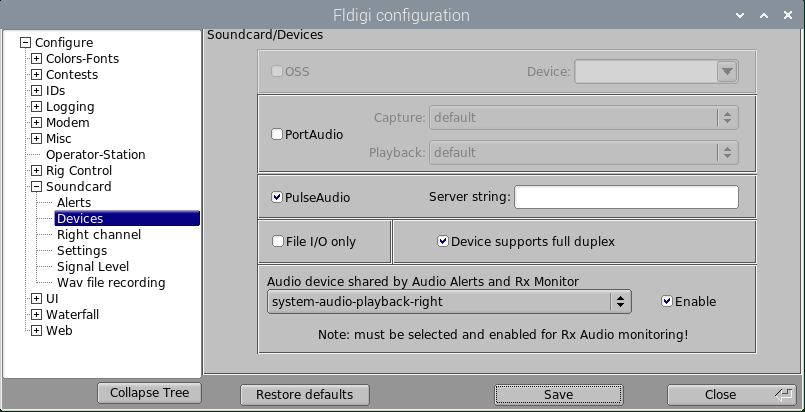
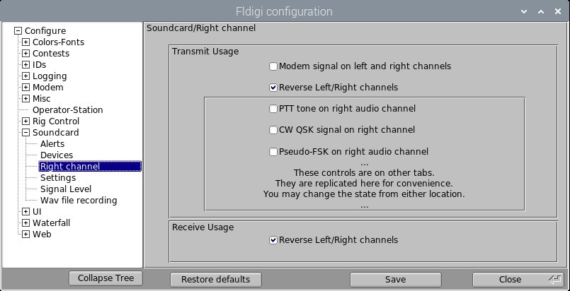
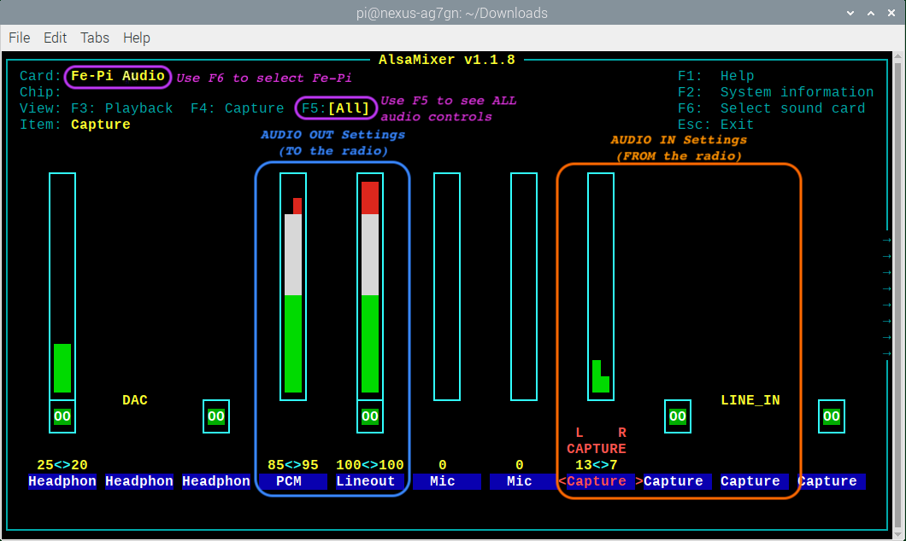

# Nexus DR-X Audio Configuration
Version: 20201210.2  
Author: Steve Magnuson, AG7GN  

## 1 Introduction

Raspbian's embrace of PulseAudio as of early December 2020 brought significant changes to the way the Nexus DR-X sound is configured.

The Nexus DR-X image has always used PulseAudio to support simultaneous use of left and right radios with a single Fe-Pi audio board. Now that the OS *also* uses PulseAudio, some changes to the default PulseAudio configuration were needed to make things operate as they were before. 

As of early December 2020, by default PulseAudio is configured to automatically detect sound devices attached to the Pi. This works fine for the built in analog (the TRS or headphone jack built in to the Pi) and digital (audio output from the HDMI ports on the Pi). However, PulseAudio fails spectacularly when it comes to setting up the Fe-Pi audio board.

To rectify this, I finally arrived a solution that minimally affects the default PulseAudio configuration yet provides all the functionality we need to use the Fe-Pi audio card for ham radio applications.

## 2 PulseAudio Modifications to Support Fe-Pi

Three modifications are needed for PulseAudio to support the Fe-Pi and retain it's normal PulseAudio operation.

### 2.1 Tell PulseAudio to ignore the Fe-Pi when it's autodetecting audio interfaces

This is accomplished by adding a `/etc/udev/rules.d/89-pulseaudio-fepi.rules` file. This file has one line:

	ATTRS{id}=="Audio", ENV{PULSE_IGNORE}="1"

The `ATTRS{id}` looks for the string __Audio__. This ID is how the cards identify themselves to [ALSA](https://alsa-project.org/wiki/Main_Page). The Fe-Pi's ID is simply __Audio__.  When a match is made, it sets an environment variable `PULSE_IGNORE` to 1 ('true'). This tells PulseAudio to ignore cards that identify themselves as ALSA ID __Audio__ during PulseAudio's autodetect process.

The `89` at the beginning of the file name is used to determine the order in which the rules are executed. PulseAudio's rules are stored in `/usr/lib/udev/rules.d/90-pulseaudio.rules` and `/usr/lib/udev/rules.d/91-pulseaudio-rpi.rules`. Note that rules installed as part of the application are stored in `/usr/lib/udev/rules.d/`. User rules are stored in `/etc/udev/rules.d/`.  Since our file starts with `89`, it is executed before regular PulseAudio rules, ensuring that PulseAudio will ignore the Fe-Pi.

### 2.2 Manually configure the PulseAudio Fe-Pi settings

PulseAudio searches for it's configuration instructions in one of 2 places when PulseAudio is run in "user" mode. It first searches the user's home folder at `$HOME/.config/pulse/default.pa`. If that file is not found, it'll look for `/etc/pulse/default.pa`. 

I added `$HOME/.config/pulse/default.pa` to include the Fe-Pi configuration as well additional configuration that allows TX/RX monitoring through the built-in sound interfaces.

The first line in `$HOME/.config/pulse/default.pa` is:

	.include /etc/pulse/default.pa

This tells PulseAudio to load the original `/etc/pulse/default.pa` that was installed as part of PulseAudio, *before* we add our own Fe-Pi configuration. This should reduce the impact of future updates to the PulseAudio application on the Fe-Pi configuration.

The remainder of `$HOME/.config/pulse/default.pa` contains:

	# Fe-Pi card setup
	load-module module-alsa-card device_id="Audio" name="fepi" card_name="fepi" \
	namereg_fail=false tsched=yes fixed_latency_range=no ignore_dB=no deferred_volume=yes \
	use_ucm=no rate=96000 format=s16le source_name="fepi-capture" \
	sink_name="fepi-playback" mmap=yes profile_set=default.conf
	
This tells PulseAudio to manually load the Fe-Pi card (`load-module module-alsa-card device_id="Audio"`), assign it the name `fepi`, set up some other audio parameters and define a PulseAudio source of `fepi-capture` and a sink of `fepi-playback`. It also tells PulseAudio to use the Stereo In/Out profile in `/usr/share/pulseaudio/alsa-mixer/profile-sets/default.conf`.

The next lines in `$HOME/.config/pulse/default.pa` are:

	# Create the left source/sink from the Fe-Pi
	load-module module-remap-sink sink_name="fepi-playback-left" master="fepi-playback" \
	channels=1 channel_map="mono" master_channel_map="front-left" remix=no \
	
	load-module module-remap-source source_name="fepi-capture-left" master="fepi-capture" \
	channels=1 channel_map="mono" master_channel_map="front-left" remix=no
	
	# Create the right source/sink from the Fe-Pi
	load-module module-remap-sink sink_name="fepi-playback-right" master="fepi-playback" \
	channels=1 channel_map="mono" master_channel_map="front-right" remix=no \
	
	load-module module-remap-source source_name="fepi-capture-right" \
	master="fepi-capture" channels=1 channel_map="mono" \
	master_channel_map="front-right" remix=no

This tells PulsAudio to create separate left and right channel playback (sink) and capture (source) virtual interfaces that we can tell ALSA to use for those ham radio applications like Direwolf that can't use PulseAudio directly.

The next lines in `$HOME/.config/pulse/default.pa` are not related to the Fe-Pi:

	# Create a stereo combined sink for the headphone and HDMI audio interfaces
	# so we don't have to know which is active at any given time
	load-module module-combine-sink sink_name=system-audio-playback \
	sink_properties=device.description='"Combined\ headphone\ and\ HDMI\ sink"' \
	slaves=alsa_output.platform-bcm2835_audio.analog-stereo,\
	alsa_output.platform-bcm2835_audio.digital-stereo channels=2

The above line creates a combined sink (playback) for both the analog (headphone) and digital (HDMI) audio interfaces that are built in to the Pi. The combine sink allows audio to go to BOTH analog and HDMI sound cards so we don't have to figure out which sound card the user has selected for system sounds (like alerts in Fldigi). Note that I named the combined sink `system-audio-playback`. The `slaves` are the IDs of the Pi's built-in analog and digital sound cards.

Finally, the last lines in `$HOME/.config/pulse/default.pa` are:

	# Create a left sink from combined headphone/HDMI built-in sound card sink 
	load-module module-remap-sink sink_name="system-audio-playback-left" \
	master="system-audio-playback" channels=1 channel_map="mono" \
	master_channel_map="front-left" remix=no

	# Create a right sink from combined headphone/HDMI built-in sound card sink
	load-module module-remap-sink sink_name="system-audio-playback-right" \
	master="system-audio-playback" channels=1 channel_map="mono" \
	master_channel_map="front-right" remix=no

The above lines create separate sinks for the left and right radios, corresponding to the left and right channels of the Pi's built in sound cards. These sinks can be selected in Fldigi, for example, to send alerts from the left radio to the left channel of the built-in sound cards and alerts from the right radio to the right channel of the built-in sound cards. 

### 2.3 Create virtual ALSA interfaces

Virtual ALSA interfaces are needed because some ham radio applications (like Direwolf) cannot use PulseAudio directly. The virtual ALSA interfaces use the PulseAudio sources/sinks we defined in `$HOME/.config/pulse/default.pa`.

Virtual ALSA interfaces are defined in `/etc/asound.conf`:

	pcm.fepi-capture-left {
	   type pulse
	   device "fepi-capture-left"
	}
	pcm.fepi-playback-left {
	   type pulse
	   device "fepi-playback-left"
	}
	pcm.fepi-capture-right {
	   type pulse
	   device "fepi-capture-right"
	}
	pcm.fepi-playback-right {
	   type pulse
	   device "fepi-playback-right"
	}
	pcm.system-audio-playback {
	   type pulse
	   device "system-audio-playback"
	}
	pcm.system-audio-playback-left {
	   type pulse
	   device "system-audio-playback-left"
	}
	pcm.system-audio-playback-right {
	   type pulse
	   device "system-audio-playback-right"
	}

## 3 How Ham Radio apps use PulseAudio

When PulseAudio starts, it uses certain default interfaces for audio output and input. These defaults are marked with an asterisk when listing the sources (input) and sinks (output) with `pacmd` in the Terminal:

	pi@nexus:~ $ pacmd list-sinks | grep -A1 "*"
	  * index: 1
		name: <alsa_output.platform-bcm2835_audio.analog-stereo>
	pi@nexus:~ $ pacmd list-sources | grep -A1 "*"
	  * index: 3
		name: <fepi-capture>

The source (audio input) default is the Fe-Pi, so that should be OK for ham radio applications like Fldigi. PulseAudio picked the Fe-Pi as the default source because there are no other sources. The built-in sound interfaces are sinks (output) only.

However, the default sink (audio output) is the built-in analog (headphone) sound card. Clearly, that's not what we want for ham radio applications.  We need to send audio to the radio, not the Pi's built in sound card.

First, some background. Fldigi uses PulseAudio directly. You simply check the __PulseAudio__ box in __Configure > Config dialog > Soundcard > Devices__:

Note that there's no place in Fldigi to tell it to use a particular PulseAudio interface. So how does it work? The answer is to define [environment variables](https://linuxize.com/post/how-to-set-and-list-environment-variables-in-linux/).  When you click on __Raspberry > Hamradio > Fldigi (left-or-right radio)__, Nexus starts Fldigi like this:

	PULSE_SINK=fepi-playback PULSE_SOURCE=fepi-capture fldigi ...

The `PULSE_SINK` and `PULSE_SOURCE` environment variables tell PulseAudio that when Fldigi starts, don't use the PulseAudio defaults. Instead, use the Fe-Pi PulseAudio virtual audio cards for input and output audio. This allows other apps to  simultaneously use PulseAudio in the default way - through the built-in sound card.

Remember that the Fe-Pi is a stereo sound card, and I defined `fepi-capture` and `fepi-playback` to be stereo as well in the `$HOME/.config/pulse/default.pa` file by specifying the stereo in/out profile. Fldigi has controls that allow you to tell it to use the left or right channels of a stereo sound card. So, for __Fldigi (left radio)__, the __Soundcard > Right channel__ settings look like this:

So, the left radio only uses the left channel.

For the __Fldigi (right radio)__, the __Soundcard > Right channel__ settings look like this:

The boxes checked above tell fldigi (right radio) to use the right channel.

This allows 2 instances of Fldigi, one on the left radio and one on the right, to run at the same time.

Direwolf can't use PulseAudio. It requires access to the sound card. Remember `/etc/asound.conf` from earlier? That file defines virtual ALSA sound cards that use PulseAudio sound interfaces. So, we can select `fepi-capture-left` and `fepi-playback-left` as the sound cards for Direwolf.  Direwolf doesn't know or care that under the hood, PulseAudio is managing the audio.

Generally, applications that cannot use PulseAudio directly can use the virtual ALSA devices.

## 4 Adjust Audio Settings  

### 4.1 Start `alsamixer`
Open a terminal and run:

	alsamixer

Press __F1__ for help familiarizing yourself with navigating the `alsamixer` interface.  
Some controls are in stereo.  The up and down arrows change the levels of both left (for the left radio) and right (for the right radio) channels. The left and right arrows selects the control.
      
- Pressing __Q__ or __E__ increases the left or right channel (radio) level respectively. 
	
- Pressing __Z__ or __C__ decreases the left or right channel (radio) level respectively.

- Press __F6__ and select __Fe-Pi Audio__ from the list. 

- Press __F5__ to see all audio controls.  

	The blue box in the screenshot below shows the controls for output (to the radio) audio levels and the orange box shows the controls for input (from the radio) audio levels. For the Fe-Pi, these levels are good starting points.

	

	Leave the remaining settings as-is. Note that I've shown the left and right __PCM__ channels and the __L R CAPTURE__ settings at different levels. This is to show that you can independently change the left and right channel levels. Different radios produce and require different audio levels, so some experimentation is needed to get the levels right. 
	
	You will want to open `alsamixer` while running Fldigi and/or direwolf and adjust
these settings on __Fe-Pi Audio__ as needed: 

	- __Capture__ (for audio coming from the radio into the Pi - radio RX)  
	- __PCM__ (for audio coming from the Pi to the radio - radio TX)

	W6AF has published a [guide to setting FM audio levels](https://w6af.com/local-radio-activity/digital-modes/setting-up-sound-levels-for-fm-digital-operation/) using Fldigi that seems to work well for FM.
	IMPORTANT: W6AF's instructions assume that you have the Fldigi waterfall settings set to default values, which are:
	- Upper signal level (db): 0 
	- Signal range (db): 60
	- Tx level attenuator (db): -3
	
	These 3 settings are at the bottom of the Fldigi window.	Once you're happy with your audio settings, press __Esc__ to exit alsamixer.  

### 4.2 Save Audio Settings (not required)
These audio settings should save automatically, but for good measure you can store them again by running:

		sudo alsactl store

If you want to save different audio level settings for different scenarios, 
you can run this command to save the settings (__choose your own file name/location__):

		sudo alsactl --file $HOME/mysoundsettings1.state store

...and this command to restore those settings:

		sudo alsactl --file $HOME/mysoundsettings1.state restore
		
If you want to use these settings when the Pi boots, add this line to your crontab (run `crontab -e` to edit your crontab):
	
		@reboot [ -s $HOME/mysoundsettings1.state ] && sudo alsactl --file $HOME/mysoundsettings1.state restore >/dev/null 2>&1

### 4.3 Adjusting the Volume of the Built-In Sound Cards

The Pi's built-in sound interface can output audio to the audio jack on the board.  This is the __Analog__ output.  It can also send audio to HDMI-attached monitors that have built-in speakers.  This is the __HDMI__ output.  To toggle between __Analog__ and __HDMI__, right-click on the speaker icon on the menu bar in the upper right corner. Select __AV Jack__ for audio out of the headphone jack built in to your Pi or __HDMI__ for audio sent to your audio-equipped monitor. 

To adjust the level of the audio on your Pi's speakers, use the speaker's volume knob if it has one.  The speaker icon in the upper right of the Pi desktop also controls the Pi's speaker volume.  

Another way is to adjust the volume in alsamixer (__0 bcm2835 HDMI__ and __1 bcm2835 Headphones__ devices).  

## 5 (Optional) Monitor Radio's TX and/or RX audio on Pi's Speakers

If you have speakers connected to the Pi, you can configure `pulseaudio` to monitor the audio to and/or from the radio.  Click __Raspberry > Hamradio > Start Radio RX Montitor or Start Radio TX Monitor__ from the menu. __Raspberry > Hamradio > Stop Radio TX and RX Monitors__ stops all the monitors.

## 6 (Optional) Using Fldigi 4.1.09 (and later) Alerts, Notifications and RX Monitoring

Fldigi version 4.1.09 introduced the ability to control where alerts, notifications and monitoring audio is sent.  Obviously, you don't want to send that audio to the radio so having the ability to control where it goes is important.

### 6.1 Fldigi Alerts

Note that Fldigi [Alerts](http://www.w1hkj.com/FldigiHelp/audio_alerts_page.html) won't work for FSQ because it only looks in the signal browser for any text you specify in the alert.

The sound interface used for Alerts and RX Monitoring is set in __Configure > Config Dialog > Soundcard > Devices__.  

1.	In the __Alerts/RX Audio__ section, select `system-audio-playback-left` or `system-audio-playback-right` depending on what radio and instance of Fldigi you're using, and check `Enable Audio Alerts`.  Click __Save__ and __Close__.
1.	In the left pane of the __Fldigi configuration__ window, select __Alerts__ to set up your alerts.  

All alerts will now play through the Pi's built-in sound interface.  Don't forget to select __Analog__ or __HDMI__ output as described earlier.

### 6.2 Fldigi Notifications

Unlike Alerts, Fldigi [Notifications](http://www.w1hkj.com/FldigiHelp/notifier_page.html) can look for text in Fldigi's Receive Messages pane.  To set up an audio alert in Fldigi, open __Configure > Notifications__ 

1.	Enter your search criteria.
2.	Under __Run Program__, enter the following:

		aplay -D system-audio-playback <path-to-WAV-file>
	For example:

		aplay -D system-audio-playback /home/pi/myalert.wav

This will send audio triggered by a Notification to the built-in audio interface.  Don't forget to select __Analog__ or __HDMI__ output as described earlier.

You can also use `paplay`, the PulseAudio player, which can play OGG audio files in addition to WAV files.  You can optionally tell `paplay` what audio sink to use.  Example:

		paplay --device=system-audio-playback /home/pi/fsq_ag7gn.ogg
		
Use this command list the audio formats `paplay` supports:

		paplay --list-file-formats

Both `aplay` and `paplay` are installed by default in Raspbian Buster.

### 6.3 Fldigi RX Monitoring

Fldigi has built-in audio monitoring capability.  You can toggle RX monitoring on and off and apply filtering to the received audio by going __View > Rx Audio Dialog__.  The audio will be played through the built-in audio interface.  Don't forget to select __Analog__ or __HDMI__ output as described earlier. Note that you must have Audio Alerts configured and enabled in Fldigi for this to work (__Configure > Config Dialog > Soundcard > Devices__).
